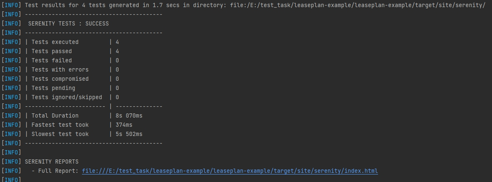

# LeasePlan Test Framework

This framework is builded using:

- Java Serenity BDD
- Maven
- Cucumber/Gherkin
- RestAssured
- JUnit
- Gitlab CI

## The project directory structure
The project has build scripts for both Maven and Gradle, and follows the standard directory structure used in most Serenity projects:
```Gherkin
src
  + main
  + test
    + java                        Test runners and supporting code
      +starter
        + stepdefinitions         Step definitions for cucumber scenarios
        TestRunner                TestRunner
			
    + resources
      + features.search           Feature files                     
        post_product.feature      Cucumber scenarios
```

## How to install project

Clone project repository from VCS:

	`git clone https://github.com/nataliadovha/leaseplan-example.git`
	
## How to write new API test case

- create new step definition file or edit existing files 
- create new feature file for new test case 
- create additional files/packages for implement new test case

## How to run tests from IDE

Run tests: 

	`mvn clean verify serenity:aggregate`

## Generating the reports
Since the Serenity reports contain aggregate information about all of the tests, they are not generated after each individual test (as this would be extremenly inefficient). Rather, The Full Serenity reports are generated by the `serenity-maven-plugin`. You can trigger this by running `mvn serenity:aggregate` from the command line or from your IDE.

They reports are also integrated into the Maven build process: the following code in the `pom.xml` file causes the reports to be generated automatically once all the tests have completed when you run `mvn verify`?

```
             <plugin>
                <groupId>net.serenity-bdd.maven.plugins</groupId>
                <artifactId>serenity-maven-plugin</artifactId>
                <version>${serenity.maven.version}</version>
                <configuration>
                    <tags>${tags}</tags>
                </configuration>
                <executions>
                    <execution>
                        <id>serenity-reports</id>
                        <phase>post-integration-test</phase>
                        <goals>
                            <goal>aggregate</goal>
                        </goals>
                    </execution>
                </executions>
            </plugin>
```
Serenity report will be recorded in the `target/site/serenity` directory:




## What was refactored:
 - refactored test steps and feature file
 - deleted all Gradle directories, files and mentions in .gitignore because required framework: Java Serenity + Maven
 - deleted empty and unused directories (.m2 and history)
 - deleted empty and not needed tags in pom.xml
 - changed some version in pom.xml
